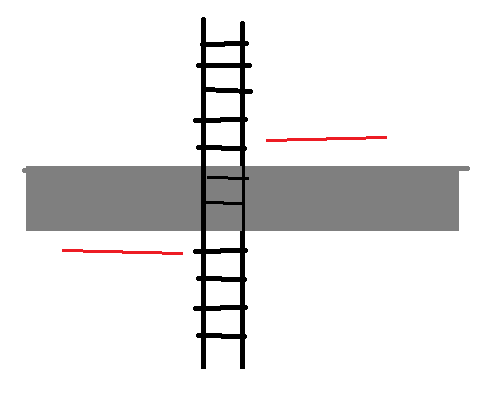

# Our train project
What we have done can be explained by this mindmap.

Bla bla bla bla

Saker vi har kvar att göra:
1. Dokumentation
2. ~~Räkna ut hur långt varje tåg har kommit vid varje Tick()~~
3. Kolla distansen från stationen tåget är på jämfört emot distansen på nästa station och isåfall stanna tåget om den har åkt förbi
4. Passagerare?
5. Spara ORMobjekt
6. ~~Ladda travelplan~~
7. Unit tests!!! (done?)
8. ~~Level crossing~~
9. (Skapa upp filstruktur för ORM)
10. Spara järnvägen till travelplan!!!
11. Städa koden.

var travelPlan1 = new TrainPlaner(train1).FollowSchedule(scheduleTrain1).LevelCrossing().CloseAt("10:23").OpenAt("10:25").SetSwitch(switch1, SwitchDirection.Left).SetSwitch(switch2, SwitchDirection.Right).ToPlan();

var travelPlan2 = new TrainPlaner(train2).StartTrainAt("10:23").StopTrainAt("10:53").ToPlan();

*[1]------------[2]

Interface
{
	StartTrainAt()
	StopTrainAt()
	ToPlan();
}

TrainPlaner klass
{
	StartTrainAt(string tid)
	{
	}

	StopTrainAt("10:53")

	ToPlan();
}

Tåg klass
{
	int	Id
	string	Name
	int	MaxSpeed
	bool	Operated
}
