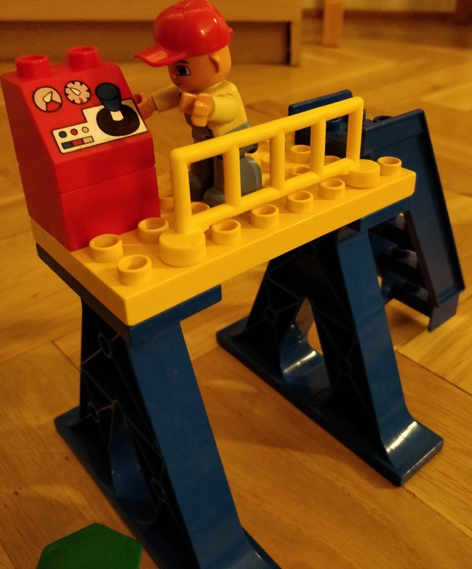

# Project 2 - The train track

For the procedures used in this project see : [Procedures](Procedures.md)

For the documentation by the team see: [Documentation/readme.md](Documentation/readme.md)

# Tre train track

The goal of this project is to create a small train simulator.

The track consist if four stations, two end stations and two in-between, on separate tracks. 

The trains on the track is controlled by the control tower where the operator (mr Carlos), makes sure the trains follows the time schedule by starting and stopping the trains at the stations, he also controls the level crossing (the trains can't parse an open crossing thanks to the [ETCS system](https://en.wikipedia.org/wiki/European_Train_Control_System)) and the railroad switches.




The track have currently two active trains going back and forward Golden Arrow and Lapplandståget, it has previously been operated by other trains, but these are no longer in service. 


Each train have a wagon with passengers, and these gets on and of at different stations.

There can only be one train at each station at the time. If there is currently not room for the train must it wait until the other train has left.

## Your assignment

The project is parted into three parts, and the suggestion is to implement the project in the suggested order. Remember to create unit tests, where possible throughout the project.

### Part 1 - A fluent API to plan the trains

Produce a fluent API used by mr Carlos to manually plan the trains, it could maybe look something like this:

#### Old Pseudo:
```C#
var travelPlan1 = new TrainPlaner(train1).FollowSchedule(scheduleTrain1).LevelCrossing().CloseAt("10:23").OpenAt("10:25").SetSwitch(switch1, SwitchDirection.Left).SetSwitch(switch2, SwitchDirection.Right).ToPlan();

var travelPlan2 = new TrainPlaner(train2).StartTrainAt("10:23").StopTrainAt("10:53").ToPlan();
```

#### New Pseudo:
```C#
TrainConsole train1 = new Train("Name of train");
Station station1 = new Station("Gothenburg");
Station station2 = new Station("Stockholm");

ITravelPlane travelPlane = new TrainPlanner(train1, station1)
          .HeadTowards(station2)
          .StartTrainAt("10:23")
          .StopTrainAt(station2, "14:53")
          .GeneratePlan();
```

### Part 2 - Develop an ORM for reading the data

Create your own mini ORM for the data provided. 

It should also be possible to save and load a travel plan made using the Fluent API.

```C#
travelPlane.Save("Data/travelplan-train1.txt"); // json
travelPlane.Load("Data/travelplan-train1.txt"); // json
```

### Part 3 - Simulate train track

It should be possible to start the trains on the track, a bit like this:

```c#
train.Start();
train.Stop();
```

The though is that each train should have it's own thread running without the knowledge of other trains in the track. But aware of signals on the track. The train is automatically stopping at all stations but are signaled by Mr Carlos when to go on (according to the time table). 

## Given

Some files are given in this repository.

**Data**

This folder contains six files:

* Passengers (*passengers.txt*): A list of possible passengers, missing information on where the passengers are going
  * columns separated by ';'
* Stations (*stations.txt*): All trains stations on the track, 
  * columns separated by '|'
* Timetable (*timetable.txt*): contains information on when each train is leaving and arriving the stations, should be extended with more departures per train
  * columns separated by ','
* Trains (*trains.txt*): contains a list of trains, some trains are not active
  * columns separated by ','

- Train track (*traintrack.txt*): Describes the track, it contains the stations and the tracks in between:
  - The stations placement eg: `[1]`
  - The start station: `*`
  - Tracks: `-`, `/` and `\`
  - Railroad switches: `<` and `>`
  - Level crossing: `=`
- Controllerlog (*controllerlog.txt*): An empty file which should be populated as time progress with information  relevant for the controller, like:
  - Which trains are arriving to the stations and when
  - When are the level crossing changing state (open or closed)
  - When are the railway switches changing position, and to what

**Documentation**

The folder initially only contains one file called *readme.md*, this file is more or less empty.

In this folder should you place digital representations of all documentation you do. Screenshots, photos (of CRC cards, mindmaps, diagrams).

Please make a link and descriptive text in the *readme.md* using the markdown notation:

```markdown
# Our train project
What we have done can be explained by this mindmap.

Bla bla bla bla
```

**Source**

The source folder contains a solution with three projects. With a small code outline.

* TrainEngine, .NET Standard 2.1, This project should contain all the logic of you program
* TrainConsole, NET 5, This project is what starts when you start the project, is a console application
* TrainEngine.Tests, .NET 5, This project should contain all of your automated tests